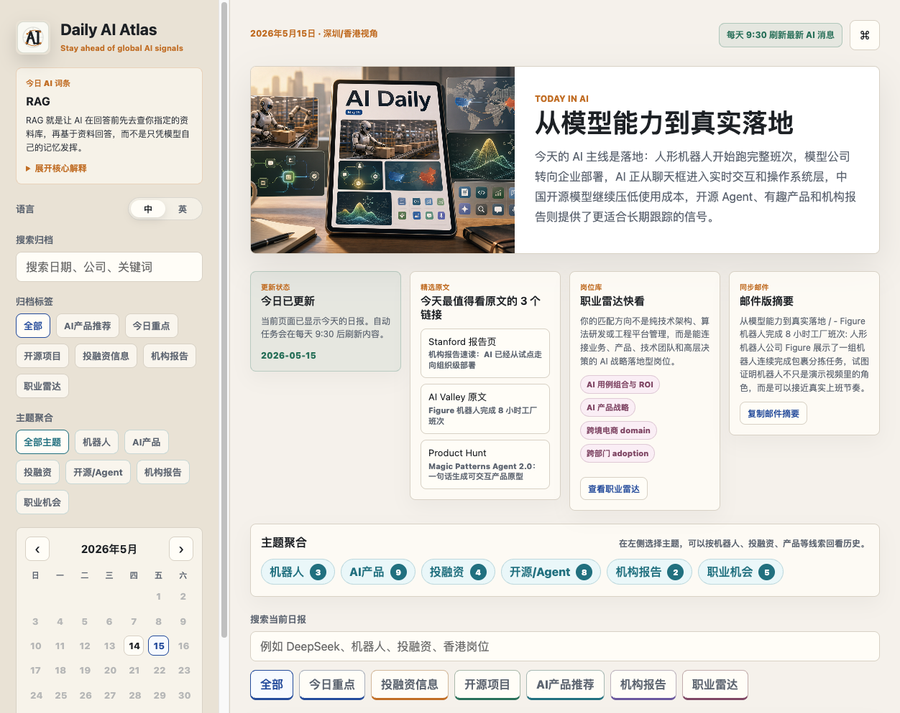

# Daily AI Atlas

一句话说明：Daily AI Atlas 是一个面向 AI 从业者、战略/产品/运营同学和好奇读者的 AI newsletter 网站，帮助你每天快速看懂全球 AI 新闻、产品、开源项目、机构报告和职业机会。

## Demo

线上地址：[https://daily-ai-atlas.vercel.app](https://daily-ai-atlas.vercel.app)

GitHub Pages 镜像：[https://irisxqing.github.io/daily-ai-atlas/](https://irisxqing.github.io/daily-ai-atlas/)

## Screenshot



## Features

- AI 生成/整理 newsletter：按今日重点、投融资、开源项目、AI 产品推荐、机构报告、职业雷达等板块组织。
- 邮件版摘要：网页内生成可复制的 email brief，适合和每日自动任务或邮件发送工具衔接。
- 文章归档：按日期保存历史日报，支持日历切换和历史回看。
- 主题聚合：按机器人、AI 产品、投融资、开源/Agent、机构报告、职业机会等主题筛选内容。
- 原始来源精选：每天自动挑出 3 个最值得打开的原文链接。
- 来源可信度标记：为内容标注官方确认、多源交叉、社区热度、机构报告、需继续验证等信号。
- 双语阅读：默认简体中文，支持英文切换。
- 图文/视频卡片：支持产品截图、GitHub preview、视频嵌入和图片加载失败兜底。
- 职业雷达：聚合 AI strategy / AI transformation / AI product strategy 等非纯技术岗位方向，并总结能力缺口。
- 静态部署：无需后端即可部署到 Vercel、GitHub Pages 或 Netlify。

## Tech Stack

- HTML / CSS / Vanilla JavaScript
- Static data archive in `app.js`
- Vercel for production hosting
- GitHub Pages as mirror hosting
- Codex automation for daily content generation and publishing workflow
- Python `http.server` for local preview

## Why I Built This

AI 新闻太多、太快，也太容易变成碎片化焦虑。我想要的不是又一个信息流，而是一张每天更新的 AI 地图：既能快速扫到今天发生了什么，也能沉淀长期趋势、产品灵感、机构观点和职业机会。Daily AI Atlas 就是为这个使用场景做的。

## Getting Started

Clone the repo and run a local static server:

```bash
git clone git@github.com:irisxqing/daily-ai-atlas.git
cd daily-ai-atlas
python3 -m http.server 8765
```

Open:

```text
http://localhost:8765/
```

The site is fully static. Daily issues live inside `app.js`, while layout and interaction logic are handled by `index.html`, `styles.css`, and `app.js`.

## Roadmap

- Add a real email subscription flow, likely with Resend or another email provider.
- Add RSS output for each daily issue.
- Add a lightweight editor/admin panel for newsletter templates and archive entries.
- Add saved/bookmarked articles and “read later” state.
- Add richer historical analytics, such as topic trends over 7/30/90 days.
- Improve mobile reading further, especially video cards and long reports.
- Add structured source metadata for each story.

## Feedback

欢迎提交 issue、star 或 fork。也欢迎建议新的 AI 信息源、产品推荐标准、职业雷达方向或版式改进。
