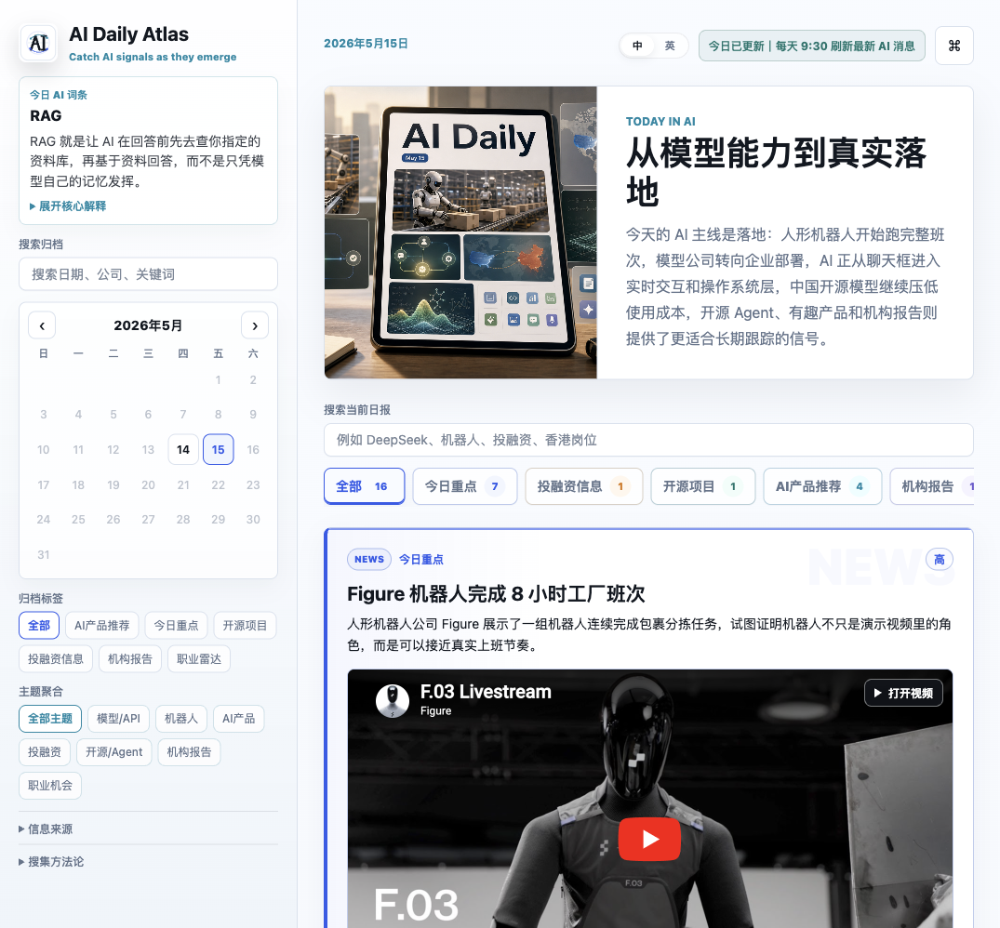

# AI Daily Atlas

AI Daily Atlas is a bilingual AI newsletter website for people who want to catch global AI signals early, without drowning in noisy feeds.

AI Daily Atlas 是一个中英双语 AI newsletter 网站，帮助关注 AI 的战略、产品、运营和研究型读者，第一时间抓住全球 AI 信号，而不是被碎片信息淹没。

## Why I Built This / 为什么做这个

AI news moves too fast. A single day can include model updates, funding rounds, open-source agents, robotics demos, product launches, research reports, and new tools worth trying. I wanted something more useful than another endless feed: a daily map that helps me see what matters, why it matters, and which original sources are worth opening.

AI 新闻太多、太快，也太容易变成碎片化焦虑。我想要的不是又一个信息流，而是一张每天更新的 AI 地图：既能快速扫到今天发生了什么，也能沉淀长期趋势、产品灵感、机构观点和可追踪的原始来源。

## Demo / 在线演示

Website: [https://irisxqing.github.io/daily-ai-atlas/](https://irisxqing.github.io/daily-ai-atlas/)

线上地址：[https://irisxqing.github.io/daily-ai-atlas/](https://irisxqing.github.io/daily-ai-atlas/)

## Screenshot / 首页截图



## Features / 功能

- **每日 AI 信号简报**：把全球 AI 新闻整理成可快速阅读的日报，覆盖今日重点、投融资、开源项目、AI 产品推荐和机构报告。
  **Daily AI signal briefing**: turns global AI updates into a readable daily briefing across top stories, funding, open source, product picks, and research reports.

- **面向非技术读者的解释方式**：不只罗列新闻，也解释公司背景、事件细节、为什么重要，以及可能影响哪些行业和工作流。
  **Non-technical friendly context**: goes beyond headlines by explaining company background, event details, why it matters, and which workflows may be affected.

- **高价值 AI 产品发现**：优先推荐知识管理、研究工作台、跨模型记忆、Agent 工作流和产品原型等真正能进入工作场景的工具。
  **High-signal AI product discovery**: prioritizes tools that can enter real workflows, including knowledge bases, research workbenches, cross-model memory, agent workflows, and prototyping.

- **机构报告深读**：报告条目支持展开，查看核心观点、关键数据、原始 quote、图表线索和下载/阅读链接。
  **Research report deep dives**: report bullets expand into core takeaways, key data, original quotes, chart references, and source links.

- **原始来源可追溯**：每张信息卡片都会突出原文、官网、GitHub、报告或媒体链接，方便继续追踪一手信息。
  **Traceable original sources**: every card highlights source links such as articles, official pages, GitHub repositories, reports, or media.

- **双语阅读体验**：默认简体中文，支持轻量中/英切换，适合中文阅读和英文原始资料之间来回切换。
  **Bilingual reading experience**: Simplified Chinese by default, with a lightweight CN/EN switch for moving between Chinese summaries and English source material.

- **归档与标签检索**：通过月历、关键词搜索和标签筛选查看历史日报，让每日内容可以长期沉淀。
  **Archive and tag search**: calendar navigation, keyword search, and tag filters make daily issues reusable over time.

- **今日 AI 词条**：每天解释一个 AI 概念，帮助读者逐步建立 AI 领域的基础词汇和判断框架。
  **Daily AI term spotlight**: explains one AI concept each day to build vocabulary and judgment over time.

- **图文并茂的信息卡片**：支持图片、视频式预览、GitHub preview 和加载失败兜底，让信息流更容易扫读。
  **Media-rich information cards**: supports images, video-style previews, GitHub previews, and graceful fallbacks for easier scanning.

- **静态网站发布**：无需后端即可本地预览并通过 GitHub Pages 发布，适合轻量维护和公开分享。
  **Static-site publishing**: runs without a backend, supports local preview, and can be published via GitHub Pages for lightweight sharing.

## Tech Stack / 技术栈

- HTML / CSS / Vanilla JavaScript
- Static issue archive stored in `app.js`
- GitHub Pages for public hosting
- Codex-assisted workflow for content updates, local preview, and publishing
- Python `http.server` for local development preview

## Getting Started / 本地运行

Clone the repo and run a local static server:

```bash
git clone git@github.com:irisxqing/daily-ai-atlas.git
cd daily-ai-atlas
python3 -m http.server 8765
```

Open:

```text
http://localhost:8765/
```

The site is fully static. Daily issues live inside `app.js`, while layout and interactions are handled by `index.html`, `styles.css`, and `app.js`.

这是一个纯静态网站。日报内容主要存放在 `app.js`，页面结构和交互分别由 `index.html`、`styles.css` 和 `app.js` 处理。

## Broadcast Generation / 每日口播稿生成

Generate a Chinese broadcast script from the latest issue in `app.js`:

```bash
node tools/generate-broadcast.mjs
```

Generate a specific issue or English version:

```bash
node tools/generate-broadcast.mjs --date 2026-05-15 --out broadcasts/2026-05-15-zh.md
node tools/generate-broadcast.mjs --lang en --date 2026-05-15 --stdout
```

生成结果会保存到 `broadcasts/YYYY-MM-DD-zh.md`，可以直接作为播客、短视频口播、微信群语音或 LinkedIn 摘要的底稿。

## Automation / 自动更新

- **每日自动更新**：GitHub Actions 在 UTC 23:30 运行，也就是北京时间每天 7:30。
  **Daily automation**: GitHub Actions runs at 23:30 UTC, which is 7:30 Beijing time every day.

- **覆盖窗口**：每天覆盖过去 24 小时内的重要 AI 信号。
  **Coverage window**: each issue covers important AI signals from the past 24 hours.

- **发布方式**：脚本会更新 `app.js`，提交到 `main`，然后 GitHub Pages 自动刷新。
  **Publishing flow**: the script updates `app.js`, commits to `main`, and GitHub Pages refreshes automatically.

- **必需 Secret**：在 GitHub repository secrets 中添加 `OPENAI_API_KEY`。可选 repository variables：`OPENAI_MODEL`、`OPENAI_REASONING_EFFORT`。
  **Required secret**: add `OPENAI_API_KEY` to GitHub repository secrets. Optional repository variables: `OPENAI_MODEL`, `OPENAI_REASONING_EFFORT`.

## Roadmap / 接下来想做

- **搭建可维护的内容后台**：增加轻量编辑/admin 面板，用来维护日报模板、归档内容、产品推荐和报告条目。
  **Build a maintainable content backend**: add a lightweight editor/admin panel for daily templates, archive entries, product picks, and report items.

- **结构化信息源与评分逻辑**：为每条新闻增加来源类型、可信度、地区、公司、主题和推荐理由，提升筛选质量。
  **Add structured source metadata and scoring**: capture source type, confidence, region, company, topic, and selection rationale for each story.

- **邮件订阅与自动发送**：支持用户订阅，并把每日 7:30 生成的内容自动发送到邮箱。
  **Add email subscription and delivery**: let readers subscribe and receive the daily 7:30 briefing by email.

- **RSS 输出**：为每日 issue 生成 RSS，让读者可以在自己的阅读器里订阅。
  **Publish RSS feeds**: generate RSS output for each daily issue so readers can subscribe in their own feed readers.

- **收藏与稍后阅读**：支持保存重要文章、产品和报告，并标记已读/待读状态。
  **Add bookmarks and read-later state**: let readers save important articles, products, and reports, with read/unread status.

- **主题趋势分析**：增加 7/30/90 天趋势视图，看哪些公司、技术方向和产品类别正在升温。
  **Add topic trend views**: show 7/30/90-day trends for companies, technologies, and product categories.

- **移动端深度优化**：继续优化手机上的长报告阅读、媒体卡片、标签筛选和归档浏览。
  **Improve mobile reading**: refine long-report reading, media cards, tag filters, and archive browsing on mobile.

## Feedback / 反馈

Issues, stars, forks, and source suggestions are welcome.

欢迎提交 issue、star 或 fork。也欢迎建议新的 AI 信息源、产品推荐标准、报告来源和版式改进。
